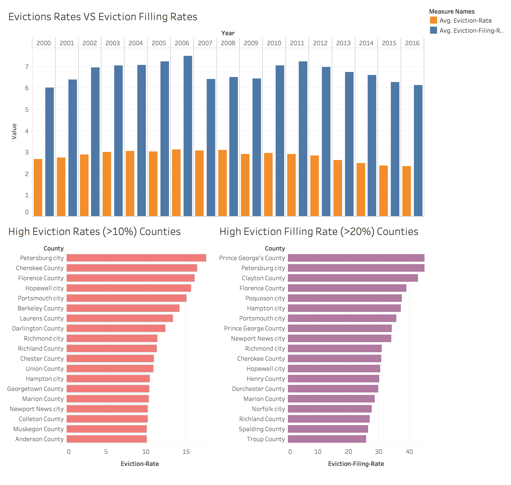
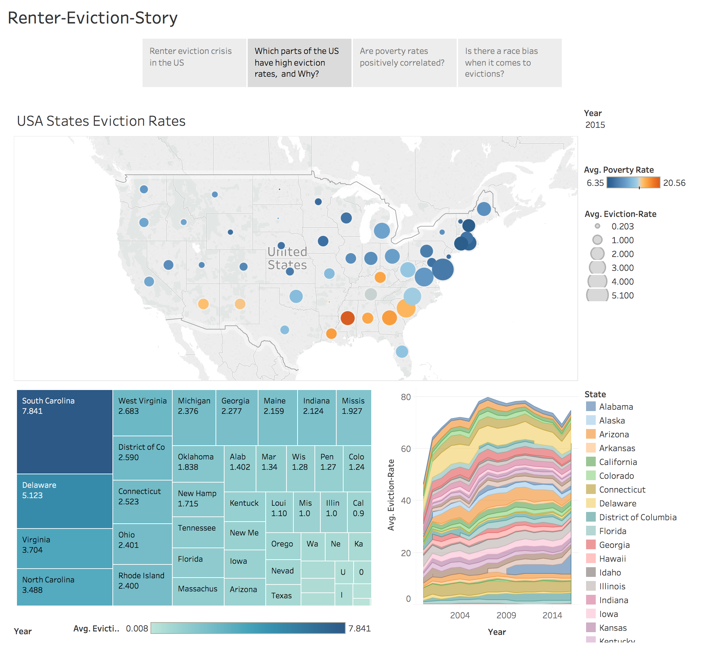
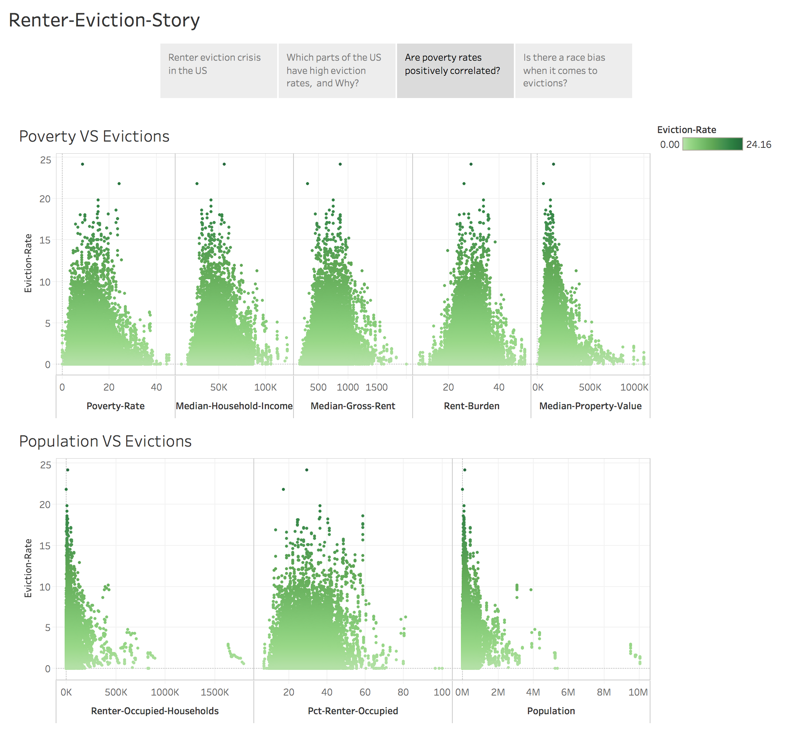
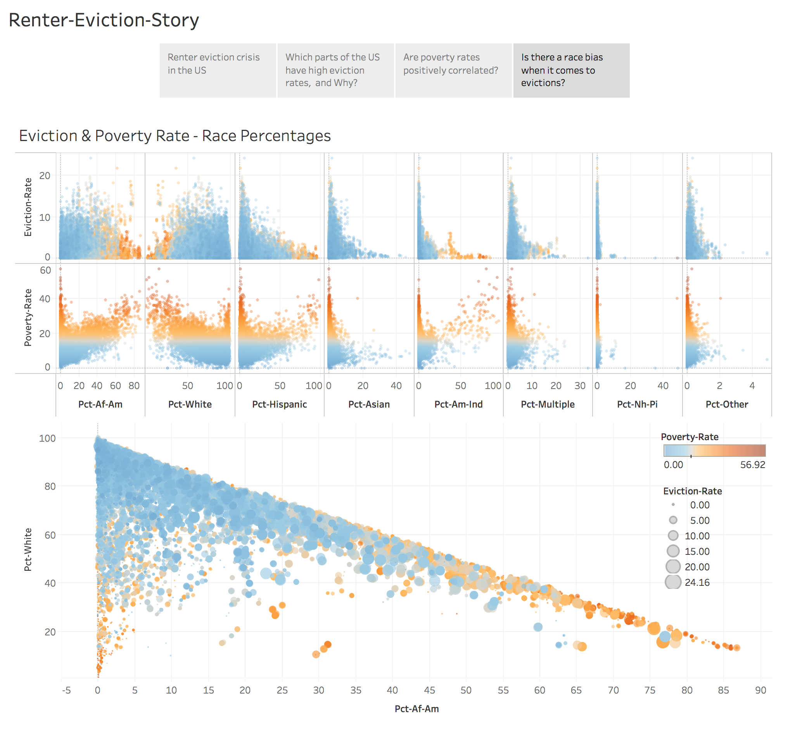
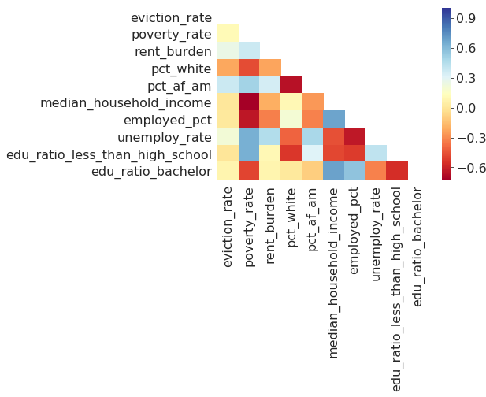

# EVICTION CRISIS IN THE US

## MOTIVATION:

In 2016, the Pulitzer Prize winner, Evicted, by sociologist Matthew Desmond, shone a spotlight on the burden and trauma caused by renter evictions in the US. In April 2018, the first-ever data set about evictions across 48 states and the District of Columbia was released by Eviction Lab—Desmond’s research group at Princeton University. To date, the Lab had collected 83 million records and it shows that in 2016, there were almost 900, 000 evictions (renter ordered to leave), and over 2.35 million evictions filed by court. This statistic shows that the national wide average eviction rates and eviction filling rates in 2016 is about 2.34% and 6.12%. Considering that not all evictions make it to court or are officially documented by cities and counties, the actual eviction crisis should be even worse.

Evictions cause lots of trouble for both the landlord and tenants, and even the neighborhood, or the whole society.

The landlords usually won’t be able to collect the rent before the evictions, and after the evictions they may face a difficulty in finding good candidates for future tenants in a short amount of time. The tenants who get evicted may end up be homeless, and homeless situation usually causes poverty and even crimes, which would be a social problem.

From the government’s point of view, it is beneficial to understand the causes of evictions, so laws can be made to regulate the eviction process and provide more assistance for those helpless tenants who got evicted.

From the real estate investors’ or landlord’s point of view, prediction of the eviction rates in a neighborhood can help reduce potentially financial loss.

From the tenants’ point of view, prediction of the eviction rates in a neighborhood would also help them find a more secured home: less chances of being evicted, and less chances of staying in a neighborhood with potentially high crime rates.

## DATA SOURCES:
The Eviction Lab has created the first publicly available database of evictions in the United States. The data contains 83 million records from 2000 – 2016 across the country, primarily from court filings (some of which exist only on paper and not in a digital database) and documentation. It includes eviction data from 2000 to 2016 against census information like income, race, age, rent burden and more.

Other data sets, including education levels, employment rates, college/university locations, found from internet are also merged and analyzed. 
The total data sets size is > 50 Mb.

## VISUALIZATION AND STATISTICAL ANALYSIS:

#### interactive Visualization

Interactive plots are posted in [**Heroku Interactive Visualization**](https://boiling-tor-78414.herokuapp.com/evictions)

Data visualization is first presented with a **Tableau story** (attached below), and then with various python plots (see below).

### Statistical Tests

Statistical tests and visualization together answering the questions: Are poverty rates positively correlated? Is there a race bias when it comes to evictions?
Are eviction rates the same for the bottom and top 25% poverty rates? [see **statistical tests**](https://github.com/SophieGarden/Renter-Eviction-Predict/blob/master/Eviction_Statistic_Test.ipynb)

Causal Inference: Using **Propensity model** to estimate race causal effect on evictions. ( see [**Causal_Effect_Race_Eviction**]( https://github.com/SophieGarden/Renter-Eviction-Predict/blob/master/Causal_Effect_Race_Eviction.ipynb))

### More data: crime rates, employment, and education status

The correlation of crime rates of the following years of high eviction rates is another very interesting topic to investigate. (see [**Visualization at Eviction_VS_Crime**](https://github.com/SophieGarden/Renter-Eviction-Predict/blob/master/Eviction_VS_Crime.ipynb))

Furthermore, data sets of employment status and education status are also merged with eviction rates data set and is shown in [**merge with more data**](https://github.com/SophieGarden/Renter-Eviction-Predict/blob/master/Eviction_Labor_Edu_Crime.ipynb), and [**visualization before predictions**](https://github.com/SophieGarden/Renter-Eviction-Predict/blob/master/eviction_predict.ipynb)

## PREDICTIONS OF EVICTION RATES:

Xgboost with regression tree is used. xgb.XGBRegressor is fast, works very well out of the box, a good fast initial approach to get understanding of features that could help.

### Parameter tuning:
Hyper-parameter optimizers: GridSearchCV 

### Prediction evaluations

Xgboost algorithm is applied and predict the eviction rate with < 0.7 rms error with cross validation ( the std of variables is ~ 2). Other evaluation metrics are also listed in  [**Eviction predictions**](https://github.com/SophieGarden/Renter-Eviction-Predict/blob/master/eviction_predict.ipynb)

## FUTURE IMPROVEMENT

Some data requires extra organization before merges. It would be better to find data sets with more detailed information.

