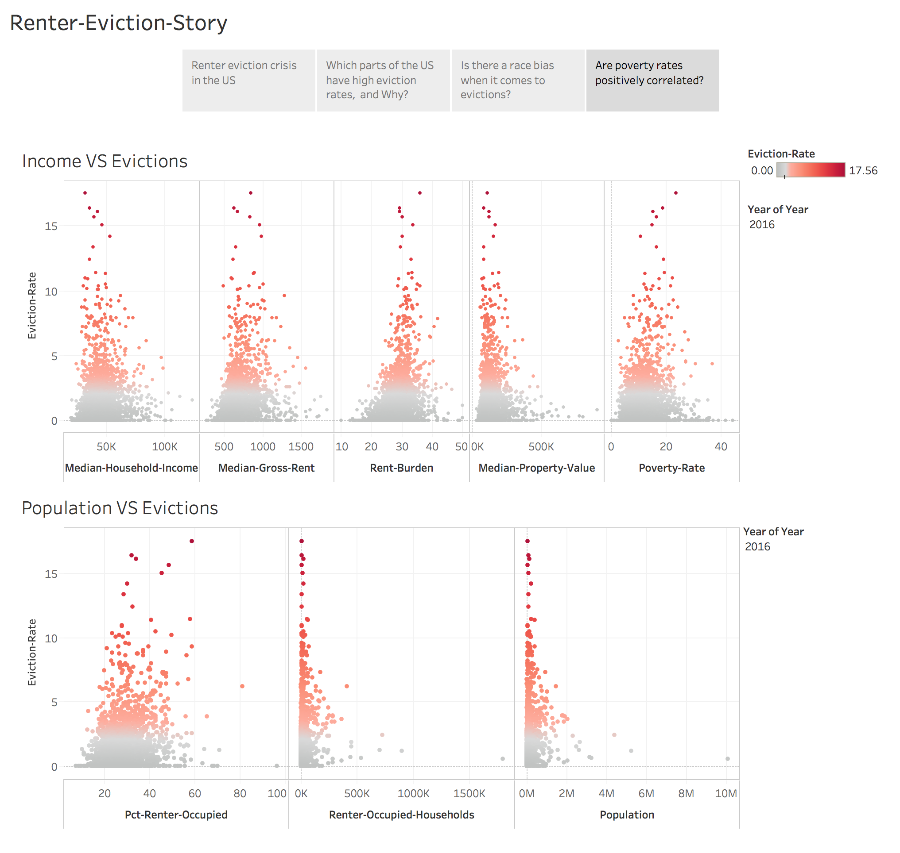

# EVICTION CRISIS IN THE US

## MOTIVATION:
Evictions cause lots of trouble for both the landlord and tenants, and even the neighborhood, or the whole society.

The landlords usually won’t be able to collect the rent before the evictions, and after the evictions they may face a difficulty in finding good candidates for future tenants in a short amount of time. The tenants who get evicted may end up be homeless, and homeless situation usually causes poverty and even crimes, which would be a social problem.

From the government’s point of view, it is beneficial to understand the causes of evictions, so laws can be made to regulate the eviction process and provide more assistance for those helpless tenants who got evicted.

From the real estate investors’ or landlord’s point of view, prediction of the eviction rates in a neighborhood can help reduce potentially financial loss.

From the tenants’ point of view, prediction of the eviction rates in a neighborhood would also help them find a more secured home: less chances of being evicted, and less chances of staying in a neighborhood with potentially high crime rates.

## DATA SOURCES:
The Eviction Lab has created the first publicly available database of evictions in the United States. The data contains 83 million records from 2000 – 2016 across the country, primarily from court filings (some of which exist only on paper and not in a digital database) and documentation. It includes eviction data from 2000 to 2016 against census information like income, race, age, rent burden and more.

Other data sets, including education levels, employment rates, college/university locations, found from internet are also merged and analyzed. 
The total data sets size is around 50 Mb.

## VISUALIZATION AND STATISTICAL ANALYSIS:
First, data visualization is presented with a Tableau story (attached below), and python plots.

Second, statistical tests and visualization together answering the questions: Are poverty rates positively correlated? Is there a race bias when it comes to evictions?

Furthermore, the correlations of crime rates of the following years of high eviction rates would be another very interesting topic to investigate.

## PREDICTIONS OF EVICTION RATES:
Xgboost algorithm is applied and predict the eviction rate with 0.7 rms error with cross validation.
Xgboost, regression tree, fast, works very well out of the box, good fast initial approach to get understanding of features that could help.

## FUTURE IMPROVEMENT
Some data requires extra organization.   before merges. It would be better to find data sets with more detailed information.

## Python codes for statistical testings and eviction rates prediction is shown in eviction_predict.md

## Interactive plots are posted in Heroku: https://boiling-tor-78414.herokuapp.com/evictions

## Tableau Story for data pre-analysis

