```python
import pandas as pd
import numpy as np
import matplotlib.pyplot as plt
from sklearn.model_selection import train_test_split
from sklearn import svm
import xgboost as xgb
import seaborn as sns
from sklearn import linear_model
from sklearn.linear_model import SGDRegressor
import matplotlib.ticker
matplotlib.rcParams.update({'font.size': 16})
%matplotlib inline
```


```python
#df = pd.read_csv("block-groups.csv")
df = pd.read_csv("data/counties_US.csv")
df.dropna(axis=0, how='any', inplace=True)
#print(df.iloc[0])
columns = df.columns
renames = {}
for col in columns:
    renames[col] = col.replace('-', '_')
df = df.rename(columns=renames)
df.describe()
```


<div>
<style scoped>
    .dataframe tbody tr th:only-of-type {
        vertical-align: middle;
    }

    .dataframe tbody tr th {
        vertical-align: top;
    }

    .dataframe thead th {
        text-align: right;
    }
</style>
<table border="1" class="dataframe">
  <thead>
    <tr style="text-align: right;">
      <th></th>
      <th>GEOID</th>
      <th>year</th>
      <th>population</th>
      <th>poverty_rate</th>
      <th>pct_renter_occupied</th>
      <th>median_gross_rent</th>
      <th>median_household_income</th>
      <th>median_property_value</th>
      <th>rent_burden</th>
      <th>pct_white</th>
      <th>...</th>
      <th>pct_nh_pi</th>
      <th>pct_multiple</th>
      <th>pct_other</th>
      <th>renter_occupied_households</th>
      <th>eviction_filings</th>
      <th>evictions</th>
      <th>eviction_rate</th>
      <th>eviction_filing_rate</th>
      <th>imputed</th>
      <th>subbed</th>
    </tr>
  </thead>
  <tbody>
    <tr>
      <th>count</th>
      <td>41299.000000</td>
      <td>41299.000000</td>
      <td>4.129900e+04</td>
      <td>41299.000000</td>
      <td>41299.000000</td>
      <td>41299.000000</td>
      <td>41299.000000</td>
      <td>4.129900e+04</td>
      <td>41299.000000</td>
      <td>41299.000000</td>
      <td>...</td>
      <td>41299.000000</td>
      <td>41299.000000</td>
      <td>41299.000000</td>
      <td>4.129900e+04</td>
      <td>41299.000000</td>
      <td>41299.000000</td>
      <td>41299.000000</td>
      <td>41299.000000</td>
      <td>41299.000000</td>
      <td>41299.000000</td>
    </tr>
    <tr>
      <th>mean</th>
      <td>30928.597956</td>
      <td>2008.187753</td>
      <td>9.717697e+04</td>
      <td>12.410998</td>
      <td>26.820699</td>
      <td>592.652970</td>
      <td>42136.557350</td>
      <td>1.164624e+05</td>
      <td>26.821584</td>
      <td>79.966203</td>
      <td>...</td>
      <td>0.063298</td>
      <td>1.431872</td>
      <td>0.087025</td>
      <td>1.301934e+04</td>
      <td>892.026490</td>
      <td>374.336449</td>
      <td>1.678239</td>
      <td>3.201757</td>
      <td>0.014819</td>
      <td>0.015860</td>
    </tr>
    <tr>
      <th>std</th>
      <td>14754.405831</td>
      <td>4.819986</td>
      <td>3.287348e+05</td>
      <td>5.813251</td>
      <td>7.648861</td>
      <td>189.157504</td>
      <td>11524.034138</td>
      <td>7.300267e+04</td>
      <td>4.754268</td>
      <td>18.957256</td>
      <td>...</td>
      <td>0.611061</td>
      <td>1.426454</td>
      <td>0.150616</td>
      <td>5.425438e+04</td>
      <td>4419.432913</td>
      <td>1543.484514</td>
      <td>1.977446</td>
      <td>5.027240</td>
      <td>0.120828</td>
      <td>0.124935</td>
    </tr>
    <tr>
      <th>min</th>
      <td>1001.000000</td>
      <td>2000.000000</td>
      <td>6.700000e+01</td>
      <td>0.000000</td>
      <td>7.350000</td>
      <td>178.000000</td>
      <td>9333.000000</td>
      <td>0.000000e+00</td>
      <td>8.300000</td>
      <td>2.860000</td>
      <td>...</td>
      <td>0.000000</td>
      <td>0.000000</td>
      <td>0.000000</td>
      <td>5.000000e+00</td>
      <td>0.000000</td>
      <td>0.000000</td>
      <td>0.000000</td>
      <td>0.000000</td>
      <td>0.000000</td>
      <td>0.000000</td>
    </tr>
    <tr>
      <th>25%</th>
      <td>19089.000000</td>
      <td>2004.000000</td>
      <td>1.044500e+04</td>
      <td>8.300000</td>
      <td>21.740000</td>
      <td>464.000000</td>
      <td>34202.000000</td>
      <td>7.470000e+04</td>
      <td>23.600000</td>
      <td>69.460000</td>
      <td>...</td>
      <td>0.000000</td>
      <td>0.710000</td>
      <td>0.000000</td>
      <td>9.710000e+02</td>
      <td>5.000000</td>
      <td>3.000000</td>
      <td>0.320000</td>
      <td>0.490000</td>
      <td>0.000000</td>
      <td>0.000000</td>
    </tr>
    <tr>
      <th>50%</th>
      <td>29181.000000</td>
      <td>2008.000000</td>
      <td>2.351300e+04</td>
      <td>11.460000</td>
      <td>25.540000</td>
      <td>571.000000</td>
      <td>40657.000000</td>
      <td>9.640000e+04</td>
      <td>26.800000</td>
      <td>87.330000</td>
      <td>...</td>
      <td>0.010000</td>
      <td>1.130000</td>
      <td>0.040000</td>
      <td>2.315000e+03</td>
      <td>37.000000</td>
      <td>25.000000</td>
      <td>1.110000</td>
      <td>1.630000</td>
      <td>0.000000</td>
      <td>0.000000</td>
    </tr>
    <tr>
      <th>75%</th>
      <td>45086.000000</td>
      <td>2012.000000</td>
      <td>6.268300e+04</td>
      <td>15.315000</td>
      <td>30.430000</td>
      <td>680.000000</td>
      <td>48007.000000</td>
      <td>1.363000e+05</td>
      <td>29.800000</td>
      <td>94.790000</td>
      <td>...</td>
      <td>0.040000</td>
      <td>1.710000</td>
      <td>0.110000</td>
      <td>6.844500e+03</td>
      <td>240.000000</td>
      <td>140.000000</td>
      <td>2.320000</td>
      <td>3.800000</td>
      <td>0.000000</td>
      <td>0.000000</td>
    </tr>
    <tr>
      <th>max</th>
      <td>56045.000000</td>
      <td>2016.000000</td>
      <td>1.003839e+07</td>
      <td>45.380000</td>
      <td>100.000000</td>
      <td>1827.000000</td>
      <td>123453.000000</td>
      <td>1.000001e+06</td>
      <td>50.100000</td>
      <td>100.000000</td>
      <td>...</td>
      <td>48.300000</td>
      <td>23.490000</td>
      <td>4.900000</td>
      <td>1.792186e+06</td>
      <td>143753.000000</td>
      <td>47716.000000</td>
      <td>24.160000</td>
      <td>118.620000</td>
      <td>1.000000</td>
      <td>1.000000</td>
    </tr>
  </tbody>
</table>
<p>8 rows × 24 columns</p>
</div>


```python
df5 = df4.groupby(['year'])['eviction_filings','evictions', 'renter_occupied_households'].agg(['sum']).reset_index()
df5
```


    ---------------------------------------------------------------------------

    NameError                                 Traceback (most recent call last)

    <ipython-input-15-424e5880ad24> in <module>()
    ----> 1 df5 = df4.groupby(['year'])['eviction_filings','evictions', 'renter_occupied_households'].agg(['sum']).reset_index()
          2 df5


    NameError: name 'df4' is not defined


```python
# plt.subplot(1,2,1)
# plt.plot(df5['year'], df5['eviction_filings']['sum']/df5['renter_occupied_households']['sum']*100, '.')
# plt.ylabel('Eviction Filling Rate',fontsize=18)
# plt.xlabel
# plt.subplot(1,2,2)
# plt.plot(df5['year'], df5['evictions']['sum']/df5['renter_occupied_households']['sum']*100, '.')
# plt.ylabel('Eviction Rate',fontsize=18)
f, (ax1, ax2) = plt.subplots(1,2, sharey = True, figsize=(15, 5))

ax1.plot(df5['year'], df5['eviction_filings']['sum']/df5['renter_occupied_households']['sum']*100, 'o')
ax1.set_xlabel('Year', fontsize=18)
locator = matplotlib.ticker.MultipleLocator(2)
ax1.xaxis.set_major_locator(locator)
formatter = matplotlib.ticker.StrMethodFormatter("{x:.0f}")
ax1.xaxis.set_major_formatter(formatter)


ax1.set_ylabel('Eviction Filing Rate',fontsize=18)


ax2.plot(df5['year'], df5['evictions']['sum']/df5['renter_occupied_households']['sum']*100, 'o')
ax2.set_xlabel('Year', fontsize=18)
ax2.set_ylabel('Eviction Rate',fontsize=18)

locator = matplotlib.ticker.MultipleLocator(2)
ax2.xaxis.set_major_locator(locator)
formatter = matplotlib.ticker.StrMethodFormatter("{x:.0f}")
ax2.xaxis.set_major_formatter(formatter)
```


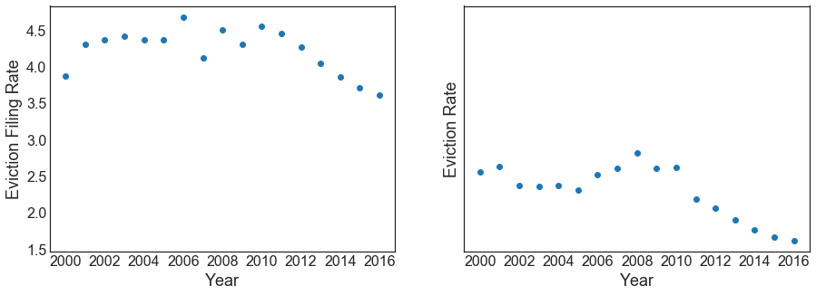


```python
#visualization
#df.hist(column= 'poverty_rate', bins = 50)
plt.show()
df.hist(column= 'eviction_rate', bins = 50)
#df.hist(column = 'median_household_income', bins = 50)
```


    array([[<matplotlib.axes._subplots.AxesSubplot object at 0x1077b8438>]],
          dtype=object)


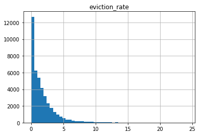


```python
def get_x_y(df, features=['poverty_rate'], label='eviction_rate'):
    #features = ['pct_af_am']
    X = df[features]
    y = df[label]
    #
    #print(X.shape, len(y))
    return X, y
```


```python
def make_plot(df, features=['poverty_rate'], label='eviction_rate'):
    X, y = get_x_y(df, features, label)
    plt.plot(X, y, '.')
```


```python
make_plot(df, ['poverty_rate'], 'eviction_rate')
```


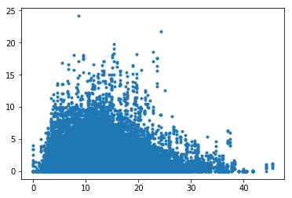


```python
df.columns
```


    Index(['GEOID', 'year', 'name', 'parent_location', 'population',
           'poverty_rate', 'pct_renter_occupied', 'median_gross_rent',
           'median_household_income', 'median_property_value', 'rent_burden',
           'pct_white', 'pct_af_am', 'pct_hispanic', 'pct_am_ind', 'pct_asian',
           'pct_nh_pi', 'pct_multiple', 'pct_other', 'renter_occupied_households',
           'eviction_filings', 'evictions', 'eviction_rate',
           'eviction_filing_rate', 'imputed', 'subbed'],
          dtype='object')


```python
print(df.iloc[0])
```

    GEOID                                   1001
    year                                    2000
    name                          Autauga County
    parent_location                      Alabama
    population                             43671
    poverty_rate                           10.92
    pct_renter_occupied                    19.21
    median_gross_rent                        537
    median_household_income                42013
    median_property_value                  94800
    rent_burden                             22.6
    pct_white                              79.74
    pct_af_am                              17.01
    pct_hispanic                             1.4
    pct_am_ind                              0.43
    pct_asian                               0.44
    pct_nh_pi                               0.03
    pct_multiple                            0.86
    pct_other                                0.1
    renter_occupied_households              3074
    eviction_filings                          61
    evictions                                 40
    eviction_rate                            1.3
    eviction_filing_rate                    1.98
    imputed                                    0
    subbed                                     0
    Name: 0, dtype: object


```python
X, y = get_x_y(df, features=['population', 'pct_renter_occupied', 'median_gross_rent', 'poverty_rate', 'rent_burden','pct_af_am'])

# X, y = get_x_y(df, features=['population',
#        'poverty_rate', 'pct_renter_occupied', 'median_gross_rent',
#        'median_household_income', 'median_property_value', 'rent_burden',
#        'pct_white', 'pct_af_am', 'pct_multiple', 'pct_other', 'renter_occupied_households'])


# X, y = get_x_y(df3, features=[ 'year','population',
#        'poverty_rate', 'pct_renter_occupied', 'median_gross_rent',
#        'median_household_income', 'median_property_value', 'rent_burden',
#        'pct_white', 'pct_af_am', 'renter_occupied_households', 'Percent of adults with less than a high school diploma 2012_2016',
#        'Percent of adults with a high school diploma only 2012_2016', 'Percent of adults completing some college or associates degree 2012_2016', \
#        'Percent of adults with a bachelors degree or higher 2012_2016','Unemployment_rate_2016', 'Med_HH_Income_Percent_of_State_Total_2016','students_total_enrollments' ])

X, y = get_x_y(df4, features=[ 'year','population',
       'poverty_rate', 'pct_renter_occupied', 'median_gross_rent',
       'median_household_income', 'median_property_value', 'rent_burden',
       'pct_white', 'pct_af_am', 'renter_occupied_households', 'Percent of adults with less than a high school diploma 2012_2016',
       'Percent of adults with a high school diploma only 2012_2016', 'Percent of adults completing some college or associates degree 2012_2016', \
       'Percent of adults with a bachelors degree or higher 2012_2016','Unemployment_rate_2016', 'Med_HH_Income_Percent_of_State_Total_2016','students_total_enrollments', 'State short_AL',
 'State short_AZ',
 'State short_CA',
 'State short_CO',
 'State short_CT',
 'State short_DE',
 'State short_FL',
 'State short_GA',
 'State short_HI',
 'State short_IA',
 'State short_ID',
 'State short_IL',
 'State short_IN',
 'State short_KS',
 'State short_KY',
 'State short_LA',
 'State short_MA',
 'State short_MD',
 'State short_ME',
 'State short_MI',
 'State short_MN',
 'State short_MO',
 'State short_MS',
 'State short_MT',
 'State short_NC',
 'State short_NE',
 'State short_NH',
 'State short_NJ',
 'State short_NM',
 'State short_NV',
 'State short_NY',
 'State short_OH',
 'State short_OK',
 'State short_OR',
 'State short_PA',
 'State short_RI',
 'State short_SC',
 'State short_TN',
 'State short_TX',
 'State short_UT',
 'State short_VA',
 'State short_VT',
 'State short_WA',
 'State short_WI',
 'State short_WV',
 'State short_WY'])


X_train, X_test, y_train, y_test = train_test_split(X, y, test_size=0.3, random_state=42)
```


```python
#clf = linear_model.SGDRegressor(max_iter=1000, tol=1e-5)
#clf.fit(X_train, y_train)
#clf.score(X_test, y_test)
```


```python
xgtrain = xgb.DMatrix(X_train.values, y_train.values)
xgtest = xgb.DMatrix(X_test.values, y_test.values)
evallist = [(xgtest, 'eval'), (xgtrain, 'train')]
param = {'silent': 1, 'max_depth': 10, 'eta': 1, 'lambda':10, 'alpha': 10, 'objective': 'reg:linear'}
```

# Prediction Results


```python
np.mean(y_test)
```


    1.6910478723404256


```python
np.mean((y_test-np.mean(y_test))**2)**.5
```


    1.9605448885755172


```python
num_round = 150
bst = xgb.train(param, xgtrain, num_round, evallist)
```

    [0]	eval-rmse:1.16512	train-rmse:1.11725
    [1]	eval-rmse:1.06779	train-rmse:0.997653
    [2]	eval-rmse:0.986824	train-rmse:0.90478
    [3]	eval-rmse:0.962381	train-rmse:0.873691
    [4]	eval-rmse:0.934691	train-rmse:0.824843
    [5]	eval-rmse:0.903576	train-rmse:0.781591
    [6]	eval-rmse:0.886863	train-rmse:0.751293
    [7]	eval-rmse:0.857376	train-rmse:0.713844
    [8]	eval-rmse:0.837297	train-rmse:0.677791
    [9]	eval-rmse:0.812172	train-rmse:0.647185
    [10]	eval-rmse:0.798538	train-rmse:0.624707
    [11]	eval-rmse:0.784989	train-rmse:0.60135
    [12]	eval-rmse:0.774627	train-rmse:0.586196
    [13]	eval-rmse:0.769508	train-rmse:0.575327
    [14]	eval-rmse:0.762501	train-rmse:0.559186
    [15]	eval-rmse:0.759237	train-rmse:0.552055
    [16]	eval-rmse:0.753586	train-rmse:0.54174
    [17]	eval-rmse:0.749146	train-rmse:0.531563
    [18]	eval-rmse:0.746188	train-rmse:0.522348
    [19]	eval-rmse:0.74423	train-rmse:0.513317
    [20]	eval-rmse:0.741992	train-rmse:0.509459
    [21]	eval-rmse:0.738664	train-rmse:0.497507
    [22]	eval-rmse:0.734997	train-rmse:0.485174
    [23]	eval-rmse:0.73332	train-rmse:0.481878
    [24]	eval-rmse:0.730152	train-rmse:0.47593
    [25]	eval-rmse:0.726514	train-rmse:0.469539
    [26]	eval-rmse:0.725002	train-rmse:0.465792
    [27]	eval-rmse:0.722781	train-rmse:0.460171
    [28]	eval-rmse:0.720658	train-rmse:0.453382
    [29]	eval-rmse:0.719399	train-rmse:0.449221
    [30]	eval-rmse:0.71824	train-rmse:0.445458
    [31]	eval-rmse:0.717439	train-rmse:0.441601
    [32]	eval-rmse:0.715618	train-rmse:0.438467
    [33]	eval-rmse:0.714969	train-rmse:0.43565
    [34]	eval-rmse:0.71378	train-rmse:0.432511
    [35]	eval-rmse:0.712109	train-rmse:0.429354
    [36]	eval-rmse:0.711922	train-rmse:0.426851
    [37]	eval-rmse:0.710919	train-rmse:0.424206
    [38]	eval-rmse:0.709924	train-rmse:0.421809
    [39]	eval-rmse:0.709604	train-rmse:0.418807
    [40]	eval-rmse:0.708815	train-rmse:0.416748
    [41]	eval-rmse:0.707961	train-rmse:0.413319
    [42]	eval-rmse:0.707008	train-rmse:0.411931
    [43]	eval-rmse:0.706434	train-rmse:0.409918
    [44]	eval-rmse:0.706216	train-rmse:0.40798
    [45]	eval-rmse:0.705287	train-rmse:0.40516
    [46]	eval-rmse:0.70446	train-rmse:0.402452
    [47]	eval-rmse:0.703651	train-rmse:0.400319
    [48]	eval-rmse:0.702905	train-rmse:0.397318
    [49]	eval-rmse:0.702018	train-rmse:0.394131
    [50]	eval-rmse:0.701714	train-rmse:0.39316
    [51]	eval-rmse:0.701339	train-rmse:0.391253
    [52]	eval-rmse:0.700743	train-rmse:0.388536
    [53]	eval-rmse:0.700484	train-rmse:0.386626
    [54]	eval-rmse:0.699972	train-rmse:0.385254
    [55]	eval-rmse:0.699666	train-rmse:0.383202
    [56]	eval-rmse:0.699449	train-rmse:0.380943
    [57]	eval-rmse:0.699442	train-rmse:0.379855
    [58]	eval-rmse:0.699195	train-rmse:0.378324
    [59]	eval-rmse:0.698457	train-rmse:0.376752
    [60]	eval-rmse:0.697997	train-rmse:0.375679
    [61]	eval-rmse:0.697696	train-rmse:0.374813
    [62]	eval-rmse:0.697893	train-rmse:0.373855
    [63]	eval-rmse:0.696511	train-rmse:0.370938
    [64]	eval-rmse:0.695988	train-rmse:0.369354
    [65]	eval-rmse:0.695677	train-rmse:0.368067
    [66]	eval-rmse:0.695523	train-rmse:0.367131
    [67]	eval-rmse:0.694886	train-rmse:0.36541
    [68]	eval-rmse:0.694579	train-rmse:0.363759
    [69]	eval-rmse:0.694554	train-rmse:0.362981
    [70]	eval-rmse:0.694062	train-rmse:0.361387
    [71]	eval-rmse:0.693702	train-rmse:0.360228
    [72]	eval-rmse:0.693342	train-rmse:0.359433
    [73]	eval-rmse:0.693	train-rmse:0.35853
    [74]	eval-rmse:0.69288	train-rmse:0.357645
    [75]	eval-rmse:0.692455	train-rmse:0.356836
    [76]	eval-rmse:0.692117	train-rmse:0.355116
    [77]	eval-rmse:0.691827	train-rmse:0.353778
    [78]	eval-rmse:0.691362	train-rmse:0.352948
    [79]	eval-rmse:0.691324	train-rmse:0.352146
    [80]	eval-rmse:0.691233	train-rmse:0.351214
    [81]	eval-rmse:0.690642	train-rmse:0.349858
    [82]	eval-rmse:0.690506	train-rmse:0.348882
    [83]	eval-rmse:0.690571	train-rmse:0.347281
    [84]	eval-rmse:0.69034	train-rmse:0.346456
    [85]	eval-rmse:0.690121	train-rmse:0.344996
    [86]	eval-rmse:0.689683	train-rmse:0.343301
    [87]	eval-rmse:0.689364	train-rmse:0.342137
    [88]	eval-rmse:0.689156	train-rmse:0.341398
    [89]	eval-rmse:0.68894	train-rmse:0.34065
    [90]	eval-rmse:0.688685	train-rmse:0.340088
    [91]	eval-rmse:0.688527	train-rmse:0.339666
    [92]	eval-rmse:0.688608	train-rmse:0.338604
    [93]	eval-rmse:0.688392	train-rmse:0.337983
    [94]	eval-rmse:0.687888	train-rmse:0.33635
    [95]	eval-rmse:0.687958	train-rmse:0.335759
    [96]	eval-rmse:0.688122	train-rmse:0.334758
    [97]	eval-rmse:0.687773	train-rmse:0.333963
    [98]	eval-rmse:0.687632	train-rmse:0.332846
    [99]	eval-rmse:0.687456	train-rmse:0.332064
    [100]	eval-rmse:0.687417	train-rmse:0.330784
    [101]	eval-rmse:0.687457	train-rmse:0.330281
    [102]	eval-rmse:0.687222	train-rmse:0.32957
    [103]	eval-rmse:0.686899	train-rmse:0.327489
    [104]	eval-rmse:0.686848	train-rmse:0.326917
    [105]	eval-rmse:0.686821	train-rmse:0.32611
    [106]	eval-rmse:0.686562	train-rmse:0.325331
    [107]	eval-rmse:0.68652	train-rmse:0.325027
    [108]	eval-rmse:0.686462	train-rmse:0.324696
    [109]	eval-rmse:0.686324	train-rmse:0.324403
    [110]	eval-rmse:0.68646	train-rmse:0.323563
    [111]	eval-rmse:0.686097	train-rmse:0.323071
    [112]	eval-rmse:0.685953	train-rmse:0.322341
    [113]	eval-rmse:0.685868	train-rmse:0.321881
    [114]	eval-rmse:0.685962	train-rmse:0.321396
    [115]	eval-rmse:0.685944	train-rmse:0.320826
    [116]	eval-rmse:0.685903	train-rmse:0.32046
    [117]	eval-rmse:0.685687	train-rmse:0.319561
    [118]	eval-rmse:0.685403	train-rmse:0.318712
    [119]	eval-rmse:0.685412	train-rmse:0.317638
    [120]	eval-rmse:0.685325	train-rmse:0.317096
    [121]	eval-rmse:0.68544	train-rmse:0.316594
    [122]	eval-rmse:0.685317	train-rmse:0.31639
    [123]	eval-rmse:0.685232	train-rmse:0.315941
    [124]	eval-rmse:0.685227	train-rmse:0.315405
    [125]	eval-rmse:0.685255	train-rmse:0.314899
    [126]	eval-rmse:0.685227	train-rmse:0.314468
    [127]	eval-rmse:0.685225	train-rmse:0.313718
    [128]	eval-rmse:0.685014	train-rmse:0.313094
    [129]	eval-rmse:0.684798	train-rmse:0.311943
    [130]	eval-rmse:0.684725	train-rmse:0.311566
    [131]	eval-rmse:0.684803	train-rmse:0.311331
    [132]	eval-rmse:0.684589	train-rmse:0.31049
    [133]	eval-rmse:0.684488	train-rmse:0.309966
    [134]	eval-rmse:0.684341	train-rmse:0.309395
    [135]	eval-rmse:0.684425	train-rmse:0.309118
    [136]	eval-rmse:0.684291	train-rmse:0.308773
    [137]	eval-rmse:0.684167	train-rmse:0.308392
    [138]	eval-rmse:0.684308	train-rmse:0.308096
    [139]	eval-rmse:0.684315	train-rmse:0.307429
    [140]	eval-rmse:0.684158	train-rmse:0.306802
    [141]	eval-rmse:0.684217	train-rmse:0.306513
    [142]	eval-rmse:0.684144	train-rmse:0.306356
    [143]	eval-rmse:0.683928	train-rmse:0.305974
    [144]	eval-rmse:0.683998	train-rmse:0.305496
    [145]	eval-rmse:0.683902	train-rmse:0.305256
    [146]	eval-rmse:0.683833	train-rmse:0.3049
    [147]	eval-rmse:0.68381	train-rmse:0.304679
    [148]	eval-rmse:0.683765	train-rmse:0.304234
    [149]	eval-rmse:0.683855	train-rmse:0.30391


```python
matplotlib.rcParams.update({'font.size': 16})
plt.subplot(1,2,1)
preds = bst.predict(xgtest)
plt.style.use('seaborn-white')
plt.plot(y_test, (y_test-preds), '.')
plt.ylabel('y_test - y_predict')
plt.xlabel('y_test')

plt.subplot(1,2,2)
plt.plot(y_test,preds,  '.')
plt.xlabel('y_test')
plt.ylabel('y_predict')
plt.tight_layout()
```


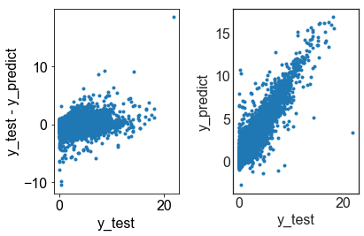


```python
make_plot(df.sample(frac=1), features=['median_gross_rent'])
```


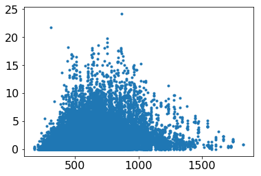


```python
import chardet
with open('data/CollegeCity.csv', 'rb') as f:
    result = chardet.detect(f.read())  # or readline if the file is large
print(result['encoding'])
```

    ISO-8859-1


```python
us_state_abbrev = {
    'Alabama': 'AL',
    'Alaska': 'AK',
    'Arizona': 'AZ',
    'Arkansas': 'AR',
    'California': 'CA',
    'Colorado': 'CO',
    'Connecticut': 'CT',
    'Delaware': 'DE',
    'Florida': 'FL',
    'Georgia': 'GA',
    'Hawaii': 'HI',
    'Idaho': 'ID',
    'Illinois': 'IL',
    'Indiana': 'IN',
    'Iowa': 'IA',
    'Kansas': 'KS',
    'Kentucky': 'KY',
    'Louisiana': 'LA',
    'Maine': 'ME',
    'Maryland': 'MD',
    'Massachusetts': 'MA',
    'Michigan': 'MI',
    'Minnesota': 'MN',
    'Mississippi': 'MS',
    'Missouri': 'MO',
    'Montana': 'MT',
    'Nebraska': 'NE',
    'Nevada': 'NV',
    'New Hampshire': 'NH',
    'New Jersey': 'NJ',
    'New Mexico': 'NM',
    'New York': 'NY',
    'North Carolina': 'NC',
    'North Dakota': 'ND',
    'Ohio': 'OH',
    'Oklahoma': 'OK',
    'Oregon': 'OR',
    'Pennsylvania': 'PA',
    'Rhode Island': 'RI',
    'South Carolina': 'SC',
    'South Dakota': 'SD',
    'Tennessee': 'TN',
    'Texas': 'TX',
    'Utah': 'UT',
    'Vermont': 'VT',
    'Virginia': 'VA',
    'Washington': 'WA',
    'West Virginia': 'WV',
    'Wisconsin': 'WI',
    'Wyoming': 'WY',
}
df['State short'] = df['parent_location'].map(us_state_abbrev)
```


```python
dfCollege0 = pd.read_csv('data/CollegeCity.csv', encoding='ISO-8859-1')
dfCollege0.drop_duplicates(subset=['UNITID'], inplace = True)
dfCollegeEnroll = pd.read_csv('data/Enrollment.csv')
dfCollegeEnroll.drop_duplicates(subset=['UNITID'], inplace = True)
dfCollege = pd.merge(dfCollege0, dfCollegeEnroll, how = 'left', on = ['UNITID'])
dfCollege.loc[dfCollege['UNITID']==210605]
```


<div>
<style scoped>
    .dataframe tbody tr th:only-of-type {
        vertical-align: middle;
    }

    .dataframe tbody tr th {
        vertical-align: top;
    }

    .dataframe thead th {
        text-align: right;
    }
</style>
<table border="1" class="dataframe">
  <thead>
    <tr style="text-align: right;">
      <th></th>
      <th>UNITID</th>
      <th>INSTNM</th>
      <th>City</th>
      <th>State short</th>
      <th>ZIP</th>
      <th>REGION</th>
      <th>LOCALE</th>
      <th>LATITUDE</th>
      <th>LONGITUDE</th>
      <th>ADM_RATE</th>
      <th>ADM_RATE_ALL</th>
      <th>EFFYLEV</th>
      <th>LSTUDY</th>
      <th>XEYTOTLT</th>
      <th>EFYTOTLT</th>
      <th>XEYTOTLM</th>
      <th>EFYTOTLM</th>
      <th>XEYTOTLW</th>
      <th>EFYTOTLW</th>
    </tr>
  </thead>
  <tbody>
    <tr>
      <th>3076</th>
      <td>210605</td>
      <td>Community College of Allegheny County</td>
      <td>Pittsburgh</td>
      <td>PA</td>
      <td>15233-1895</td>
      <td>2</td>
      <td>11.0</td>
      <td>40.450632</td>
      <td>-80.01855</td>
      <td>NaN</td>
      <td>NaN</td>
      <td>1.0</td>
      <td>999.0</td>
      <td>R</td>
      <td>26778.0</td>
      <td>R</td>
      <td>11794.0</td>
      <td>R</td>
      <td>14984.0</td>
    </tr>
  </tbody>
</table>
</div>


```python
dfCounty = pd.read_csv('data/CityCounty.csv')
dfCounty.drop('City alias', axis = 1,inplace = True)
dfCollegeCounty = pd.merge(dfCollege, dfCounty, how='left', on=['City', 'State short'])
#dfCollegeCounty.drop('City', axis = 1,inplace = True)
dfCollegeCounty.drop_duplicates(subset=['UNITID'], inplace = True)
dfCollegeCount = dfCollegeCounty.groupby(['County','State short'])['EFYTOTLT'].agg(['count','sum']).reset_index()
dfCollegeCount.rename(index=str, columns={"count": "number_of_colleges", "sum": "students_total_enrollments"}, inplace = True)
```


```python
dfCollegeCount
```


<div>
<style scoped>
    .dataframe tbody tr th:only-of-type {
        vertical-align: middle;
    }

    .dataframe tbody tr th {
        vertical-align: top;
    }

    .dataframe thead th {
        text-align: right;
    }
</style>
<table border="1" class="dataframe">
  <thead>
    <tr style="text-align: right;">
      <th></th>
      <th>County</th>
      <th>State short</th>
      <th>number_of_colleges</th>
      <th>students_total_enrollments</th>
    </tr>
  </thead>
  <tbody>
    <tr>
      <th>0</th>
      <td>ABBEVILLE</td>
      <td>SC</td>
      <td>1</td>
      <td>887.0</td>
    </tr>
    <tr>
      <th>1</th>
      <td>ACCOMACK</td>
      <td>VA</td>
      <td>1</td>
      <td>987.0</td>
    </tr>
    <tr>
      <th>2</th>
      <td>ADA</td>
      <td>ID</td>
      <td>12</td>
      <td>31698.0</td>
    </tr>
    <tr>
      <th>3</th>
      <td>ADAIR</td>
      <td>KY</td>
      <td>1</td>
      <td>3028.0</td>
    </tr>
    <tr>
      <th>4</th>
      <td>ADAIR</td>
      <td>MO</td>
      <td>4</td>
      <td>10700.0</td>
    </tr>
    <tr>
      <th>5</th>
      <td>ADAIR</td>
      <td>OK</td>
      <td>1</td>
      <td>194.0</td>
    </tr>
    <tr>
      <th>6</th>
      <td>ADAMS</td>
      <td>CO</td>
      <td>5</td>
      <td>31875.0</td>
    </tr>
    <tr>
      <th>7</th>
      <td>ADAMS</td>
      <td>IL</td>
      <td>7</td>
      <td>5468.0</td>
    </tr>
    <tr>
      <th>8</th>
      <td>ADAMS</td>
      <td>MS</td>
      <td>0</td>
      <td>0.0</td>
    </tr>
    <tr>
      <th>9</th>
      <td>ADAMS</td>
      <td>NE</td>
      <td>1</td>
      <td>1385.0</td>
    </tr>
    <tr>
      <th>10</th>
      <td>ADAMS</td>
      <td>PA</td>
      <td>2</td>
      <td>2803.0</td>
    </tr>
    <tr>
      <th>11</th>
      <td>ADDISON</td>
      <td>VT</td>
      <td>1</td>
      <td>4749.0</td>
    </tr>
    <tr>
      <th>12</th>
      <td>AGUADA</td>
      <td>PR</td>
      <td>3</td>
      <td>231.0</td>
    </tr>
    <tr>
      <th>13</th>
      <td>AGUADILLA</td>
      <td>PR</td>
      <td>6</td>
      <td>7323.0</td>
    </tr>
    <tr>
      <th>14</th>
      <td>AIKEN</td>
      <td>SC</td>
      <td>4</td>
      <td>7978.0</td>
    </tr>
    <tr>
      <th>15</th>
      <td>ALACHUA</td>
      <td>FL</td>
      <td>9</td>
      <td>80737.0</td>
    </tr>
    <tr>
      <th>16</th>
      <td>ALAMANCE</td>
      <td>NC</td>
      <td>3</td>
      <td>13587.0</td>
    </tr>
    <tr>
      <th>17</th>
      <td>ALAMEDA</td>
      <td>CA</td>
      <td>38</td>
      <td>177369.0</td>
    </tr>
    <tr>
      <th>18</th>
      <td>ALAMOSA</td>
      <td>CO</td>
      <td>1</td>
      <td>4336.0</td>
    </tr>
    <tr>
      <th>19</th>
      <td>ALBANY</td>
      <td>NY</td>
      <td>18</td>
      <td>86932.0</td>
    </tr>
    <tr>
      <th>20</th>
      <td>ALBANY</td>
      <td>WY</td>
      <td>2</td>
      <td>15056.0</td>
    </tr>
    <tr>
      <th>21</th>
      <td>ALBEMARLE</td>
      <td>VA</td>
      <td>3</td>
      <td>35269.0</td>
    </tr>
    <tr>
      <th>22</th>
      <td>ALCORN</td>
      <td>MS</td>
      <td>1</td>
      <td>194.0</td>
    </tr>
    <tr>
      <th>23</th>
      <td>ALEXANDRIA CITY</td>
      <td>VA</td>
      <td>3</td>
      <td>811.0</td>
    </tr>
    <tr>
      <th>24</th>
      <td>ALLEGAN</td>
      <td>MI</td>
      <td>1</td>
      <td>524.0</td>
    </tr>
    <tr>
      <th>25</th>
      <td>ALLEGANY</td>
      <td>MD</td>
      <td>2</td>
      <td>10292.0</td>
    </tr>
    <tr>
      <th>26</th>
      <td>ALLEGANY</td>
      <td>NY</td>
      <td>3</td>
      <td>7932.0</td>
    </tr>
    <tr>
      <th>27</th>
      <td>ALLEGHANY</td>
      <td>VA</td>
      <td>1</td>
      <td>1806.0</td>
    </tr>
    <tr>
      <th>28</th>
      <td>ALLEGHENY</td>
      <td>PA</td>
      <td>40</td>
      <td>118708.0</td>
    </tr>
    <tr>
      <th>29</th>
      <td>ALLEN</td>
      <td>IN</td>
      <td>10</td>
      <td>30462.0</td>
    </tr>
    <tr>
      <th>...</th>
      <td>...</td>
      <td>...</td>
      <td>...</td>
      <td>...</td>
    </tr>
    <tr>
      <th>1449</th>
      <td>WINNESHIEK</td>
      <td>IA</td>
      <td>2</td>
      <td>8986.0</td>
    </tr>
    <tr>
      <th>1450</th>
      <td>WINONA</td>
      <td>MN</td>
      <td>3</td>
      <td>20272.0</td>
    </tr>
    <tr>
      <th>1451</th>
      <td>WISE</td>
      <td>VA</td>
      <td>2</td>
      <td>7097.0</td>
    </tr>
    <tr>
      <th>1452</th>
      <td>WOOD</td>
      <td>OH</td>
      <td>5</td>
      <td>37116.0</td>
    </tr>
    <tr>
      <th>1453</th>
      <td>WOOD</td>
      <td>TX</td>
      <td>2</td>
      <td>1214.0</td>
    </tr>
    <tr>
      <th>1454</th>
      <td>WOOD</td>
      <td>WI</td>
      <td>1</td>
      <td>4649.0</td>
    </tr>
    <tr>
      <th>1455</th>
      <td>WOOD</td>
      <td>WV</td>
      <td>5</td>
      <td>4334.0</td>
    </tr>
    <tr>
      <th>1456</th>
      <td>WOODBURY</td>
      <td>IA</td>
      <td>5</td>
      <td>13550.0</td>
    </tr>
    <tr>
      <th>1457</th>
      <td>WOODFORD</td>
      <td>IL</td>
      <td>1</td>
      <td>707.0</td>
    </tr>
    <tr>
      <th>1458</th>
      <td>WOODFORD</td>
      <td>KY</td>
      <td>1</td>
      <td>1350.0</td>
    </tr>
    <tr>
      <th>1459</th>
      <td>WOODS</td>
      <td>OK</td>
      <td>2</td>
      <td>2701.0</td>
    </tr>
    <tr>
      <th>1460</th>
      <td>WOODWARD</td>
      <td>OK</td>
      <td>2</td>
      <td>372.0</td>
    </tr>
    <tr>
      <th>1461</th>
      <td>WORCESTER</td>
      <td>MA</td>
      <td>20</td>
      <td>62634.0</td>
    </tr>
    <tr>
      <th>1462</th>
      <td>WYANDOTTE</td>
      <td>KS</td>
      <td>2</td>
      <td>8942.0</td>
    </tr>
    <tr>
      <th>1463</th>
      <td>WYTHE</td>
      <td>VA</td>
      <td>1</td>
      <td>3916.0</td>
    </tr>
    <tr>
      <th>1464</th>
      <td>YAKIMA</td>
      <td>WA</td>
      <td>6</td>
      <td>9089.0</td>
    </tr>
    <tr>
      <th>1465</th>
      <td>YAMHILL</td>
      <td>OR</td>
      <td>1</td>
      <td>4663.0</td>
    </tr>
    <tr>
      <th>1466</th>
      <td>YANKTON</td>
      <td>SD</td>
      <td>2</td>
      <td>1739.0</td>
    </tr>
    <tr>
      <th>1467</th>
      <td>YATES</td>
      <td>NY</td>
      <td>1</td>
      <td>2358.0</td>
    </tr>
    <tr>
      <th>1468</th>
      <td>YAUCO</td>
      <td>PR</td>
      <td>1</td>
      <td>474.0</td>
    </tr>
    <tr>
      <th>1469</th>
      <td>YAVAPAI</td>
      <td>AZ</td>
      <td>3</td>
      <td>13597.0</td>
    </tr>
    <tr>
      <th>1470</th>
      <td>YELLOW MEDICINE</td>
      <td>MN</td>
      <td>1</td>
      <td>4707.0</td>
    </tr>
    <tr>
      <th>1471</th>
      <td>YELLOWSTONE</td>
      <td>MT</td>
      <td>3</td>
      <td>6860.0</td>
    </tr>
    <tr>
      <th>1472</th>
      <td>YOLO</td>
      <td>CA</td>
      <td>3</td>
      <td>42159.0</td>
    </tr>
    <tr>
      <th>1473</th>
      <td>YORK</td>
      <td>ME</td>
      <td>3</td>
      <td>14793.0</td>
    </tr>
    <tr>
      <th>1474</th>
      <td>YORK</td>
      <td>NE</td>
      <td>1</td>
      <td>462.0</td>
    </tr>
    <tr>
      <th>1475</th>
      <td>YORK</td>
      <td>PA</td>
      <td>9</td>
      <td>10584.0</td>
    </tr>
    <tr>
      <th>1476</th>
      <td>YORK</td>
      <td>SC</td>
      <td>4</td>
      <td>13878.0</td>
    </tr>
    <tr>
      <th>1477</th>
      <td>YUBA</td>
      <td>CA</td>
      <td>1</td>
      <td>10244.0</td>
    </tr>
    <tr>
      <th>1478</th>
      <td>YUMA</td>
      <td>AZ</td>
      <td>1</td>
      <td>11766.0</td>
    </tr>
  </tbody>
</table>
<p>1479 rows × 4 columns</p>
</div>


```python
dfCounty.iloc[0]
```


    City           Holtsville
    State short            NY
    State full       New York
    County            SUFFOLK
    Name: 0, dtype: object


```python
df['County'], df['type'] = df['name'].str.split(' ', 1).str
df['County'] = df['County'].str.upper()
df.iloc[0]
```


    GEOID                                   1001
    year                                    2000
    name                          Autauga County
    parent_location                      Alabama
    population                             43671
    poverty_rate                           10.92
    pct_renter_occupied                    19.21
    median_gross_rent                        537
    median_household_income                42013
    median_property_value                  94800
    rent_burden                             22.6
    pct_white                              79.74
    pct_af_am                              17.01
    pct_hispanic                             1.4
    pct_am_ind                              0.43
    pct_asian                               0.44
    pct_nh_pi                               0.03
    pct_multiple                            0.86
    pct_other                                0.1
    renter_occupied_households              3074
    eviction_filings                          61
    evictions                                 40
    eviction_rate                            1.3
    eviction_filing_rate                    1.98
    imputed                                    0
    subbed                                     0
    State short                               AL
    County                               AUTAUGA
    type                                  County
    Name: 0, dtype: object


```python
df_withCollege = pd.merge(df, dfCollegeCount, how = 'left', on =['County', 'State short'])
```


```python
df.columns
```


    Index(['GEOID', 'year', 'name', 'parent_location', 'population',
           'poverty_rate', 'pct_renter_occupied', 'median_gross_rent',
           'median_household_income', 'median_property_value', 'rent_burden',
           'pct_white', 'pct_af_am', 'pct_hispanic', 'pct_am_ind', 'pct_asian',
           'pct_nh_pi', 'pct_multiple', 'pct_other', 'renter_occupied_households',
           'eviction_filings', 'evictions', 'eviction_rate',
           'eviction_filing_rate', 'imputed', 'subbed', 'State short', 'County',
           'type'],
          dtype='object')


```python
###df_withCollege['has_college'] = 1 - df_withCollege.INSTNM.isnull()
df_withCollege.columns
```


    Index(['GEOID', 'year', 'name', 'parent_location', 'population',
           'poverty_rate', 'pct_renter_occupied', 'median_gross_rent',
           'median_household_income', 'median_property_value', 'rent_burden',
           'pct_white', 'pct_af_am', 'pct_hispanic', 'pct_am_ind', 'pct_asian',
           'pct_nh_pi', 'pct_multiple', 'pct_other', 'renter_occupied_households',
           'eviction_filings', 'evictions', 'eviction_rate',
           'eviction_filing_rate', 'imputed', 'subbed', 'State short', 'County',
           'type', 'number_of_colleges', 'students_total_enrollments'],
          dtype='object')


```python
plt.plot(df_withCollege['students_total_enrollments'], df_withCollege['eviction_rate'],'.')
plt.xlim([0,150000])
```


    (0, 150000)


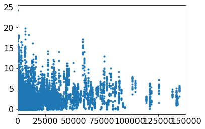


```python
dfEducation = pd.read_excel('data/Education.xls')
dfUnemployment = pd.read_excel('data/Unemployment.xls')
#dfEducation.head()
```


```python
dfEducation.columns = dfEducation.columns.str.replace("-", "_")
dfEducation.columns = dfEducation.columns.str.replace("'", "")
dfEducation.columns = dfEducation.columns.str.replace(",", "")
dfEducation['County'], dfEducation['AreaType'] = dfEducation['Area name'].str.split(' ', 1).str
dfEducation['County'] = dfEducation['County'].str.upper()

dfEducation.columns
dfEducation.head()
```


<div>
<style scoped>
    .dataframe tbody tr th:only-of-type {
        vertical-align: middle;
    }

    .dataframe tbody tr th {
        vertical-align: top;
    }

    .dataframe thead th {
        text-align: right;
    }
</style>
<table border="1" class="dataframe">
  <thead>
    <tr style="text-align: right;">
      <th></th>
      <th>FIPS Code</th>
      <th>State</th>
      <th>Area name</th>
      <th>2003 Rural_urban Continuum Code</th>
      <th>2003 Urban Influence Code</th>
      <th>2013 Rural_urban Continuum Code</th>
      <th>2013 Urban Influence Code</th>
      <th>Less than a high school diploma 1970</th>
      <th>High school diploma only 1970</th>
      <th>Some college (1_3 years) 1970</th>
      <th>...</th>
      <th>Less than a high school diploma 2012_2016</th>
      <th>High school diploma only 2012_2016</th>
      <th>Some college or associates degree 2012_2016</th>
      <th>Bachelors degree or higher 2012_2016</th>
      <th>Percent of adults with less than a high school diploma 2012_2016</th>
      <th>Percent of adults with a high school diploma only 2012_2016</th>
      <th>Percent of adults completing some college or associates degree 2012_2016</th>
      <th>Percent of adults with a bachelors degree or higher 2012_2016</th>
      <th>County</th>
      <th>AreaType</th>
    </tr>
  </thead>
  <tbody>
    <tr>
      <th>0</th>
      <td>0</td>
      <td>US</td>
      <td>United States</td>
      <td>NaN</td>
      <td>NaN</td>
      <td>NaN</td>
      <td>NaN</td>
      <td>52373312.0</td>
      <td>34158051.0</td>
      <td>11650730.0</td>
      <td>...</td>
      <td>27818380.0</td>
      <td>58820411.0</td>
      <td>62242569.0</td>
      <td>64767787.0</td>
      <td>13.021</td>
      <td>27.531</td>
      <td>29.133</td>
      <td>30.315</td>
      <td>UNITED</td>
      <td>States</td>
    </tr>
    <tr>
      <th>1</th>
      <td>1000</td>
      <td>AL</td>
      <td>Alabama</td>
      <td>NaN</td>
      <td>NaN</td>
      <td>NaN</td>
      <td>NaN</td>
      <td>1062306.0</td>
      <td>468269.0</td>
      <td>136287.0</td>
      <td>...</td>
      <td>496036.0</td>
      <td>1009593.0</td>
      <td>972703.0</td>
      <td>783076.0</td>
      <td>15.209</td>
      <td>30.956</td>
      <td>29.825</td>
      <td>24.010</td>
      <td>ALABAMA</td>
      <td>NaN</td>
    </tr>
    <tr>
      <th>2</th>
      <td>1001</td>
      <td>AL</td>
      <td>Autauga County</td>
      <td>2.0</td>
      <td>2.0</td>
      <td>2.0</td>
      <td>2.0</td>
      <td>6611.0</td>
      <td>3757.0</td>
      <td>933.0</td>
      <td>...</td>
      <td>4528.0</td>
      <td>12519.0</td>
      <td>10451.0</td>
      <td>8968.0</td>
      <td>12.417</td>
      <td>34.331</td>
      <td>28.660</td>
      <td>24.593</td>
      <td>AUTAUGA</td>
      <td>County</td>
    </tr>
    <tr>
      <th>3</th>
      <td>1003</td>
      <td>AL</td>
      <td>Baldwin County</td>
      <td>4.0</td>
      <td>5.0</td>
      <td>3.0</td>
      <td>2.0</td>
      <td>18726.0</td>
      <td>8426.0</td>
      <td>2334.0</td>
      <td>...</td>
      <td>13956.0</td>
      <td>40154.0</td>
      <td>44486.0</td>
      <td>41350.0</td>
      <td>9.972</td>
      <td>28.692</td>
      <td>31.788</td>
      <td>29.547</td>
      <td>BALDWIN</td>
      <td>County</td>
    </tr>
    <tr>
      <th>4</th>
      <td>1005</td>
      <td>AL</td>
      <td>Barbour County</td>
      <td>6.0</td>
      <td>6.0</td>
      <td>6.0</td>
      <td>6.0</td>
      <td>8120.0</td>
      <td>2242.0</td>
      <td>581.0</td>
      <td>...</td>
      <td>4824.0</td>
      <td>6422.0</td>
      <td>4775.0</td>
      <td>2366.0</td>
      <td>26.236</td>
      <td>34.927</td>
      <td>25.969</td>
      <td>12.868</td>
      <td>BARBOUR</td>
      <td>County</td>
    </tr>
  </tbody>
</table>
<p>5 rows × 49 columns</p>
</div>


```python
dfEducation.shape
```


    (3283, 49)


```python
dfUnemployment['County'], dfUnemployment['AreaType'] = dfUnemployment['Area_name'].str.split(' ', 1).str
dfUnemployment['County'] = dfUnemployment['County'].str.upper()

dfUnemployment.head()

```


<div>
<style scoped>
    .dataframe tbody tr th:only-of-type {
        vertical-align: middle;
    }

    .dataframe tbody tr th {
        vertical-align: top;
    }

    .dataframe thead th {
        text-align: right;
    }
</style>
<table border="1" class="dataframe">
  <thead>
    <tr style="text-align: right;">
      <th></th>
      <th>FIPStxt</th>
      <th>State</th>
      <th>Area_name</th>
      <th>Rural_urban_continuum_code_2013</th>
      <th>Urban_influence_code_2013</th>
      <th>Metro_2013</th>
      <th>Civilian_labor_force_2007</th>
      <th>Employed_2007</th>
      <th>Unemployed_2007</th>
      <th>Unemployment_rate_2007</th>
      <th>...</th>
      <th>Unemployed_2015</th>
      <th>Unemployment_rate_2015</th>
      <th>Civilian_labor_force_2016</th>
      <th>Employed_2016</th>
      <th>Unemployed_2016</th>
      <th>Unemployment_rate_2016</th>
      <th>Median_Household_Income_2016</th>
      <th>Med_HH_Income_Percent_of_State_Total_2016</th>
      <th>County</th>
      <th>AreaType</th>
    </tr>
  </thead>
  <tbody>
    <tr>
      <th>0</th>
      <td>1000</td>
      <td>AL</td>
      <td>Alabama</td>
      <td>NaN</td>
      <td>NaN</td>
      <td>NaN</td>
      <td>2175612.0</td>
      <td>2089127.0</td>
      <td>86485.0</td>
      <td>4.0</td>
      <td>...</td>
      <td>131614.0</td>
      <td>6.1</td>
      <td>2168608.0</td>
      <td>2038775.0</td>
      <td>129833.0</td>
      <td>6.0</td>
      <td>46309.0</td>
      <td>100.0</td>
      <td>ALABAMA</td>
      <td>NaN</td>
    </tr>
    <tr>
      <th>1</th>
      <td>1001</td>
      <td>AL</td>
      <td>Autauga County, AL</td>
      <td>2.0</td>
      <td>2.0</td>
      <td>1.0</td>
      <td>24383.0</td>
      <td>23577.0</td>
      <td>806.0</td>
      <td>3.3</td>
      <td>...</td>
      <td>1332.0</td>
      <td>5.3</td>
      <td>25649.0</td>
      <td>24297.0</td>
      <td>1352.0</td>
      <td>5.3</td>
      <td>54487.0</td>
      <td>117.7</td>
      <td>AUTAUGA</td>
      <td>County, AL</td>
    </tr>
    <tr>
      <th>2</th>
      <td>1003</td>
      <td>AL</td>
      <td>Baldwin County, AL</td>
      <td>3.0</td>
      <td>2.0</td>
      <td>1.0</td>
      <td>82659.0</td>
      <td>80099.0</td>
      <td>2560.0</td>
      <td>3.1</td>
      <td>...</td>
      <td>4874.0</td>
      <td>5.6</td>
      <td>89931.0</td>
      <td>85061.0</td>
      <td>4870.0</td>
      <td>5.4</td>
      <td>56460.0</td>
      <td>121.9</td>
      <td>BALDWIN</td>
      <td>County, AL</td>
    </tr>
    <tr>
      <th>3</th>
      <td>1005</td>
      <td>AL</td>
      <td>Barbour County, AL</td>
      <td>6.0</td>
      <td>6.0</td>
      <td>0.0</td>
      <td>10334.0</td>
      <td>9684.0</td>
      <td>650.0</td>
      <td>6.3</td>
      <td>...</td>
      <td>765.0</td>
      <td>8.8</td>
      <td>8302.0</td>
      <td>7584.0</td>
      <td>718.0</td>
      <td>8.6</td>
      <td>32884.0</td>
      <td>71.0</td>
      <td>BARBOUR</td>
      <td>County, AL</td>
    </tr>
    <tr>
      <th>4</th>
      <td>1007</td>
      <td>AL</td>
      <td>Bibb County, AL</td>
      <td>1.0</td>
      <td>1.0</td>
      <td>1.0</td>
      <td>8791.0</td>
      <td>8432.0</td>
      <td>359.0</td>
      <td>4.1</td>
      <td>...</td>
      <td>569.0</td>
      <td>6.7</td>
      <td>8573.0</td>
      <td>8004.0</td>
      <td>569.0</td>
      <td>6.6</td>
      <td>43079.0</td>
      <td>93.0</td>
      <td>BIBB</td>
      <td>County, AL</td>
    </tr>
  </tbody>
</table>
<p>5 rows × 50 columns</p>
</div>


```python
df2 = pd.merge(df_withCollege, dfEducation[['State','County','Less than a high school diploma 2012_2016',
       'High school diploma only 2012_2016',
       'Some college or associates degree 2012_2016',
       'Bachelors degree or higher 2012_2016',
       'Percent of adults with less than a high school diploma 2012_2016',
       'Percent of adults with a high school diploma only 2012_2016',
       'Percent of adults completing some college or associates degree 2012_2016',
       'Percent of adults with a bachelors degree or higher 2012_2016']], \
               how = 'left', left_on =['County', 'State short'], right_on = ['County', 'State'])
df2.head()
```


<div>
<style scoped>
    .dataframe tbody tr th:only-of-type {
        vertical-align: middle;
    }

    .dataframe tbody tr th {
        vertical-align: top;
    }

    .dataframe thead th {
        text-align: right;
    }
</style>
<table border="1" class="dataframe">
  <thead>
    <tr style="text-align: right;">
      <th></th>
      <th>GEOID</th>
      <th>year</th>
      <th>name</th>
      <th>parent_location</th>
      <th>population</th>
      <th>poverty_rate</th>
      <th>pct_renter_occupied</th>
      <th>median_gross_rent</th>
      <th>median_household_income</th>
      <th>median_property_value</th>
      <th>...</th>
      <th>students_total_enrollments</th>
      <th>State</th>
      <th>Less than a high school diploma 2012_2016</th>
      <th>High school diploma only 2012_2016</th>
      <th>Some college or associates degree 2012_2016</th>
      <th>Bachelors degree or higher 2012_2016</th>
      <th>Percent of adults with less than a high school diploma 2012_2016</th>
      <th>Percent of adults with a high school diploma only 2012_2016</th>
      <th>Percent of adults completing some college or associates degree 2012_2016</th>
      <th>Percent of adults with a bachelors degree or higher 2012_2016</th>
    </tr>
  </thead>
  <tbody>
    <tr>
      <th>0</th>
      <td>1001</td>
      <td>2000</td>
      <td>Autauga County</td>
      <td>Alabama</td>
      <td>43671.0</td>
      <td>10.92</td>
      <td>19.21</td>
      <td>537.0</td>
      <td>42013.0</td>
      <td>94800.0</td>
      <td>...</td>
      <td>NaN</td>
      <td>AL</td>
      <td>4528.0</td>
      <td>12519.0</td>
      <td>10451.0</td>
      <td>8968.0</td>
      <td>12.417</td>
      <td>34.331</td>
      <td>28.660</td>
      <td>24.593</td>
    </tr>
    <tr>
      <th>1</th>
      <td>1003</td>
      <td>2000</td>
      <td>Baldwin County</td>
      <td>Alabama</td>
      <td>140415.0</td>
      <td>10.15</td>
      <td>20.46</td>
      <td>566.0</td>
      <td>40250.0</td>
      <td>122500.0</td>
      <td>...</td>
      <td>43644.0</td>
      <td>AL</td>
      <td>13956.0</td>
      <td>40154.0</td>
      <td>44486.0</td>
      <td>41350.0</td>
      <td>9.972</td>
      <td>28.692</td>
      <td>31.788</td>
      <td>29.547</td>
    </tr>
    <tr>
      <th>2</th>
      <td>1005</td>
      <td>2000</td>
      <td>Barbour County</td>
      <td>Alabama</td>
      <td>29038.0</td>
      <td>26.80</td>
      <td>26.87</td>
      <td>333.0</td>
      <td>25101.0</td>
      <td>68600.0</td>
      <td>...</td>
      <td>NaN</td>
      <td>AL</td>
      <td>4824.0</td>
      <td>6422.0</td>
      <td>4775.0</td>
      <td>2366.0</td>
      <td>26.236</td>
      <td>34.927</td>
      <td>25.969</td>
      <td>12.868</td>
    </tr>
    <tr>
      <th>3</th>
      <td>1007</td>
      <td>2000</td>
      <td>Bibb County</td>
      <td>Alabama</td>
      <td>20826.0</td>
      <td>20.61</td>
      <td>19.81</td>
      <td>348.0</td>
      <td>31420.0</td>
      <td>74600.0</td>
      <td>...</td>
      <td>NaN</td>
      <td>AL</td>
      <td>3040.0</td>
      <td>6586.0</td>
      <td>4234.0</td>
      <td>1890.0</td>
      <td>19.302</td>
      <td>41.816</td>
      <td>26.883</td>
      <td>12.000</td>
    </tr>
    <tr>
      <th>4</th>
      <td>1011</td>
      <td>2000</td>
      <td>Bullock County</td>
      <td>Alabama</td>
      <td>11714.0</td>
      <td>33.48</td>
      <td>25.51</td>
      <td>324.0</td>
      <td>20605.0</td>
      <td>56600.0</td>
      <td>...</td>
      <td>NaN</td>
      <td>AL</td>
      <td>2452.0</td>
      <td>2504.0</td>
      <td>1625.0</td>
      <td>752.0</td>
      <td>33.438</td>
      <td>34.147</td>
      <td>22.160</td>
      <td>10.255</td>
    </tr>
  </tbody>
</table>
<p>5 rows × 40 columns</p>
</div>


```python
df3 = pd.merge(df2, dfUnemployment[['Unemployment_rate_2016', 'Med_HH_Income_Percent_of_State_Total_2016', 'County', 'State']], \
               how = 'left', left_on =['County', 'State short'], right_on = ['County', 'State'])
```


```python
df3.size
df3['Unemployment_rate_2016'].isnull().sum()
#df3.drop(['name', 'parent_location','type','State_x','State_y'], axis = 1, inplace = True)
```


    37


```python
df3.iloc[0]
```


    GEOID                                                                                 1001
    year                                                                                  2000
    name                                                                        Autauga County
    parent_location                                                                    Alabama
    population                                                                           43671
    poverty_rate                                                                         10.92
    pct_renter_occupied                                                                  19.21
    median_gross_rent                                                                      537
    median_household_income                                                              42013
    median_property_value                                                                94800
    rent_burden                                                                           22.6
    pct_white                                                                            79.74
    pct_af_am                                                                            17.01
    pct_hispanic                                                                           1.4
    pct_am_ind                                                                            0.43
    pct_asian                                                                             0.44
    pct_nh_pi                                                                             0.03
    pct_multiple                                                                          0.86
    pct_other                                                                              0.1
    renter_occupied_households                                                            3074
    eviction_filings                                                                        61
    evictions                                                                               40
    eviction_rate                                                                          1.3
    eviction_filing_rate                                                                  1.98
    imputed                                                                                  0
    subbed                                                                                   0
    State short                                                                             AL
    County                                                                             AUTAUGA
    type                                                                                County
    number_of_colleges                                                                     NaN
    students_total_enrollments                                                             NaN
    State_x                                                                                 AL
    Less than a high school diploma 2012_2016                                             4528
    High school diploma only 2012_2016                                                   12519
    Some college or associates degree 2012_2016                                          10451
    Bachelors degree or higher 2012_2016                                                  8968
    Percent of adults with less than a high school diploma 2012_2016                    12.417
    Percent of adults with a high school diploma only 2012_2016                         34.331
    Percent of adults completing some college or associates degree 2012_2016             28.66
    Percent of adults with a bachelors degree or higher 2012_2016                       24.593
    Unemployment_rate_2016                                                                 5.3
    Med_HH_Income_Percent_of_State_Total_2016                                            117.7
    State_y                                                                                 AL
    Name: 0, dtype: object


```python
#df3.plot(x='Unemployment_rate_2016', y = 'eviction_rate', style = 'o')
```


```python
plt.figure(figsize=(10,8))
plt.plot(df3['students_total_enrollments']/df3['population'], df3['eviction_rate'],'.')
plt.xlabel('% population of students / county population')
plt.ylabel('Evictioin rate')

```


    Text(0,0.5,'Evictioin rate')


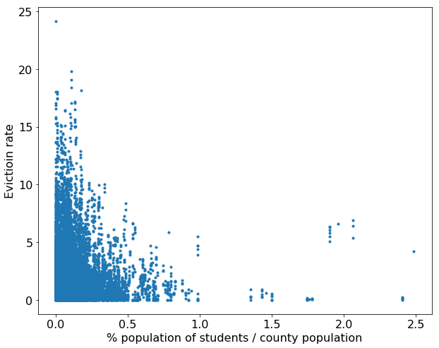


```python
f, (ax1, ax2, ax3, ax4, ax5) = plt.subplots(1,5, sharey=True, figsize = (18,8))
ax1.plot(df3['poverty_rate'],  df3['eviction_rate'],'.')
ax1.set_xlabel('poverty_rate', fontsize=15)
ax1.set_ylabel('Eviction Rate',fontsize=15)

ax2.plot(df3['median_gross_rent'],  df3['eviction_rate'],'.')
ax2.set_xlabel('median_gross_rent', fontsize=15)

ax3.plot(df3['median_household_income'],  df3['eviction_rate'],'.')
ax3.set_xlabel('median_household_income', fontsize=15)

ax4.plot(df3['median_property_value'],  df3['eviction_rate'],'.')
ax4.set_xlabel('median_property_value', fontsize=15)

ax5.plot(df3['rent_burden'],  df3['eviction_rate'],'.')
ax5.set_xlabel('rent_burden', fontsize=15)
```


    Text(0.5,0,'rent_burden')


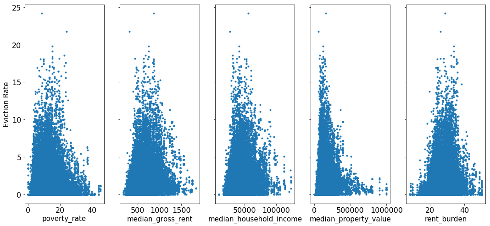


```python
f, (ax1, ax2, ax3, ax4) = plt.subplots(4,1, sharex=True,  sharey=True, figsize = (15,10))
for ax in (ax1, ax2, ax3, ax4, ax5):
    ax.set_ylabel('Eviction Rate')

ax1.plot(df3['Percent of adults with less than a high school diploma 2012_2016'],  df3['eviction_rate'],'.')
ax1.set_xlabel('Percent of adults with less than a high school diploma 2012_2016')

ax2.plot(df3['Percent of adults with a high school diploma only 2012_2016'],  df3['eviction_rate'],'.')
ax2.set_xlabel(' high school diploma only 2012_2016')

ax3.plot(df3['Percent of adults completing some college or associates degree 2012_2016'],  df3['eviction_rate'],'.')
ax3.set_xlabel('some college or associates degree 2012_2016')

ax4.plot(df3['Percent of adults with a bachelors degree or higher 2012_2016'],  df3['eviction_rate'],'.')
ax4.set_xlabel(' bachelors degree or higher 2012_2016')
```


    Text(0.5,0,' bachelors degree or higher 2012_2016')


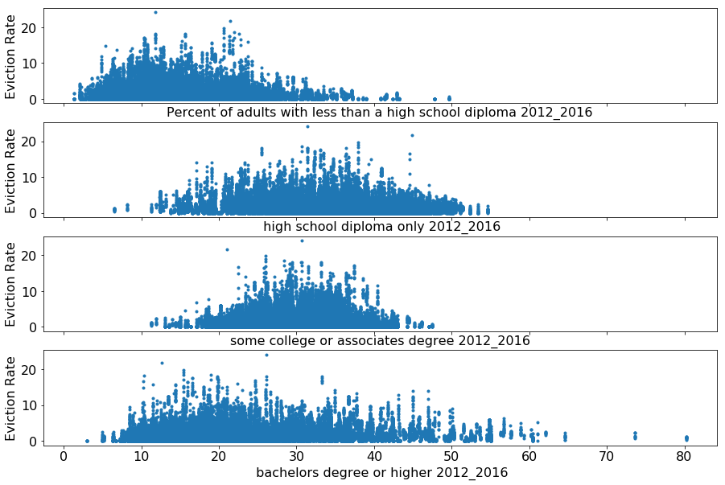


```python
#plt.style.use('seaborn-white')
f, (ax1, ax2, ax3, ax4, ax5) = plt.subplots(5,1, sharex = True, sharey = True, figsize=(10, 20))

ax1.plot(df3['pct_white'],  df3['eviction_rate'],'.')
ax1.set_xlabel('% population of White',fontsize=18)


ax2.plot(df3['pct_af_am'],  df3['eviction_rate'],'.')
ax2.set_xlabel('% population of African American',fontsize=18)

ax3.plot(df3['pct_hispanic'],  df3['eviction_rate'],'.')
ax3.set_xlabel('% population of Hispanic or Latino origin',fontsize=18)

ax4.plot(df3['pct_am_ind'],  df3['eviction_rate'],'.')
ax4.set_xlabel('% population of American Indian and Alaska Native',fontsize=18)

ax5.plot(df3['pct_asian'],  df3['eviction_rate'],'.')
ax5.set_xlabel('% population of Asian',fontsize=18)

for ax in (ax1, ax2, ax3, ax4, ax5):
    ax.set_ylabel('Eviction Rate',fontsize=18)
```


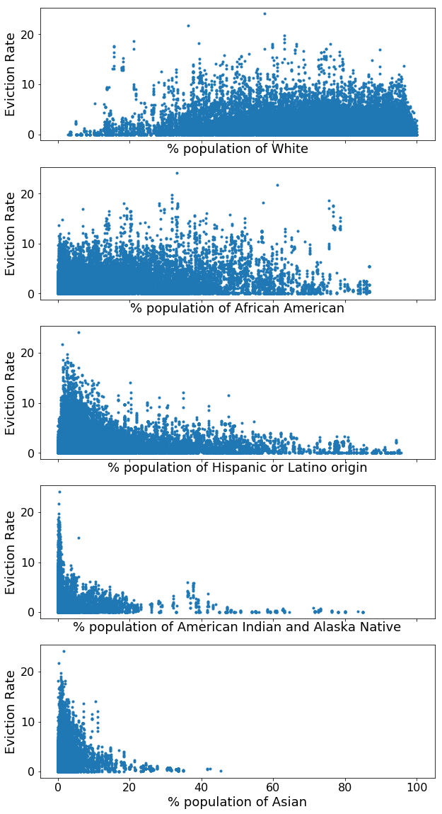


```python
plt.plot(df3['pct_renter_occupied'], df3['eviction_rate'],'.')
```


    [<matplotlib.lines.Line2D at 0x111fd26d8>]


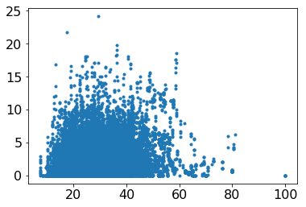


```python
plt.plot(df3['Unemployment_rate_2016'], df3['eviction_rate'],'.')
plt.xlabel('Unemployment rate')
plt.ylabel('Evictioin rate')
```


    Text(0,0.5,'Evictioin rate')


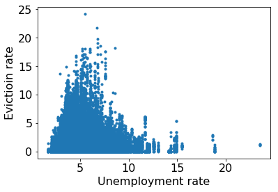


```python
plt.plot(df3['Med_HH_Income_Percent_of_State_Total_2016'], df3['eviction_rate'],'.')
plt.xlabel('Med_House_Income_Percent_of_State')
plt.ylabel('Evictioin rate')
```


    Text(0,0.5,'Evictioin rate')


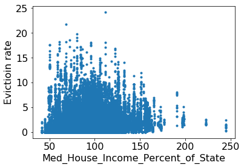


```python
df4 = pd.get_dummies(df3)
#list(df4.columns)

```


```python
df4.shape
```


    (56398, 3608)


